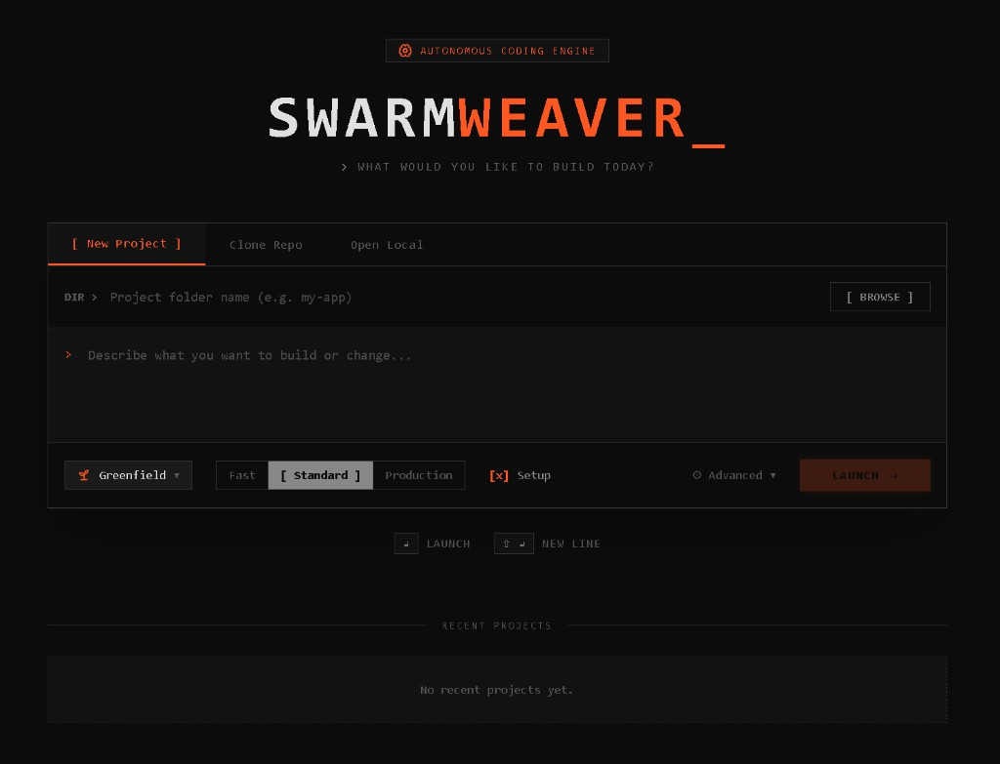
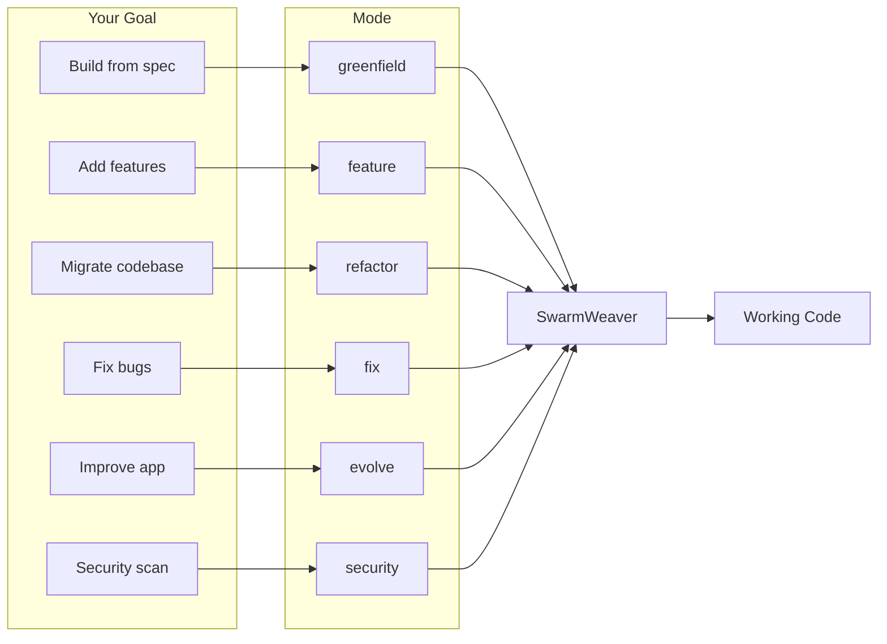
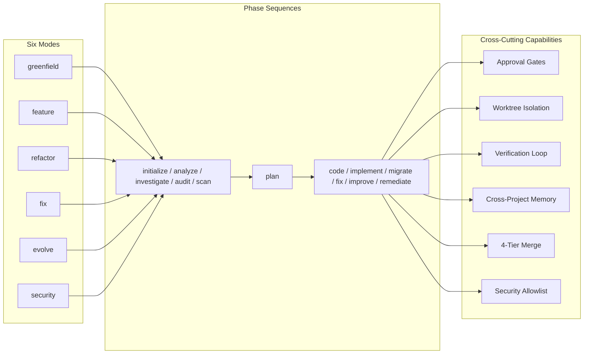
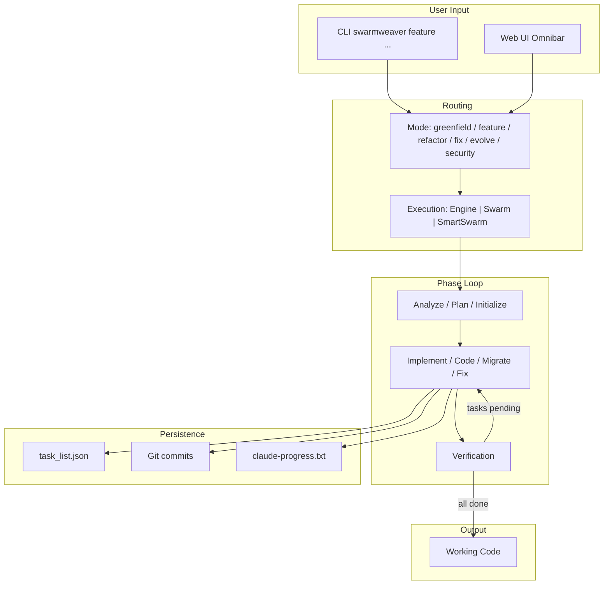
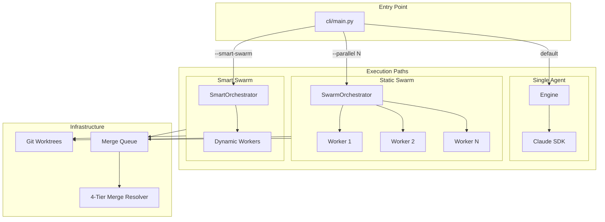

#  SwarmWeaver_

**Autonomous multi-mode coding agent** powered by the Claude Agent SDK.

<p align="center">
  
</p>
<p align="center"><em>The SwarmWeaver command center — describe what you want to build and launch.</em></p>

[](https://www.python.org/downloads/)
[](https://nodejs.org/)
[](LICENSE)
[](https://github.com/HeshamFS/swarmweaver/actions)
[](https://github.com/HeshamFS/swarmweaver#docker)

Point it at a spec, a codebase, or a bug report — it works autonomously across unlimited sessions until the job is done. Built for long-running autonomous sessions with audit trails, approval gates, and cost controls.

**Key features:** Six operation modes (greenfield, feature, refactor, fix, evolve, security) · Web UI + CLI · Git worktree isolation · Multi-agent swarm with inter-agent mail · Human-in-the-loop approval gates · Cross-project memory · MCP server integration

## Table of Contents

- [What It Does](#what-it-does)
- [End-to-End Workflow](#end-to-end-workflow)
- [Capabilities at a Glance](#capabilities-at-a-glance)
- [Prerequisites](#prerequisites)
- [Quick Start](#quick-start)
- [CLI Reference](#cli-reference)
- [Web UI](#web-ui)
- [Architecture](#architecture)
- [Docker](#docker)
- [Production Deployment](#production-deployment)
- [Development](#development)
- [Getting Help](#getting-help)
- [Related Documentation](#related-documentation)
- [Contributing](#contributing)

**Choose your goal** — each maps to a mode that flows through SwarmWeaver to working code:

| Your goal | Mode |
|-----------|------|
| Build from spec | `greenfield` |
| Add new features | `feature` |
| Migrate or restructure | `refactor` |
| Diagnose and fix bugs | `fix` |
| Improve an existing app | `evolve` |
| Security vulnerability scan | `security` |



## What It Does

SwarmWeaver is a Python harness that runs Claude as a long-running autonomous coding agent. Unlike one-shot code generation, SwarmWeaver works across **many sessions** with fresh context windows, persisting progress through a task list, git commits, and handoff notes. It can run for hours or days unattended.

**Six operation modes** cover the full lifecycle of a codebase:

| Mode | What It Does | Example |
|------|-------------|---------|
| `greenfield` | Builds a new project from a specification file | "Build me a SaaS dashboard from this spec" |
| `feature` | Adds features to an existing codebase | "Add OAuth2 login with Google and GitHub" |
| `refactor` | Restructures or migrates a codebase | "Migrate from JavaScript to TypeScript" |
| `fix` | Diagnoses and fixes bugs | "Login fails when email has a plus sign" |
| `evolve` | Improves a codebase toward a goal | "Add unit tests for 80% coverage" |
| `security` | Scans for vulnerabilities with human review | "Full security audit of the API layer" |

### Capabilities at a Glance

All modes share cross-cutting capabilities: approval gates, worktree isolation, verification loop, cross-project memory, 4-tier merge resolution, and security allowlist.



Each mode follows a **phase-based execution** pattern:

```
greenfield:  initialize ──> code* ──> code* ──> ... ──> done
feature:     analyze ──> plan ──> implement* ──> implement* ──> ... ──> done
refactor:    analyze ──> plan ──> migrate* ──> migrate* ──> ... ──> done
fix:         investigate ──> fix* ──> fix* ──> ... ──> done
evolve:      audit ──> improve* ──> improve* ──> ... ──> done
security:    scan ──> [human review] ──> remediate* ──> ... ──> done

* = looping phase (repeats until all tasks are complete)
```

## End-to-End Workflow



## Prerequisites

- **Python 3.11+** — [python.org](https://www.python.org/downloads/)
- **Node 20+** — [nodejs.org](https://nodejs.org/)
- **uv** — Fast Python package manager ([install guide](https://docs.astral.sh/uv/getting-started/installation/))
- **npm** — Bundled with Node.js

## Quick Start

### Option 1: Web UI (Recommended)

```bash
# 1. Clone and install
git clone https://github.com/HeshamFS/swarmweaver.git
cd swarmweaver
./setup.sh                   # creates venv + installs Python deps (Unix/macOS)
# On Windows: use "uv sync" and "npm install" instead
npm install                  # installs root dev tooling

# 2. Configure authentication
cp .env.example .env
# Edit .env and set one of:
#   CLAUDE_CODE_OAUTH_TOKEN=your-token   (Claude Code Max — run 'claude setup-token')
#   ANTHROPIC_API_KEY=your-key           (API key from console.anthropic.com)

# 3. Start the full stack
npm run dev
```

Open [http://localhost:3000](http://localhost:3000). Use the Omnibar to pick a mode, point it at a directory, and launch.

### Option 2: CLI

```bash
# Install with pip (globally available — recommended)
pip install -e .

# Now 'swarmweaver' works directly from any terminal
swarmweaver --help
swarmweaver greenfield --project-dir ./my_app --spec ./my_spec.txt
swarmweaver feature   --project-dir ./my_app --description "Add OAuth2 login"
swarmweaver fix       --project-dir ./my_app --issue "Login fails with plus in email"
swarmweaver evolve    --project-dir ./my_app --goal "Add 80% unit test coverage"
swarmweaver security  --project-dir ./my_app --focus "Full security audit"
```

**Alternative with uv** (uses a managed venv):

```bash
uv sync                             # install inside .venv
uv run swarmweaver --help           # run via uv
# or activate the venv directly:
source .venv/bin/activate           # Linux/macOS
# .venv\Scripts\activate            # Windows
swarmweaver --help
```

### Option 3: Docker

```bash
# Copy and configure auth
cp .env.example .env   # set ANTHROPIC_API_KEY or CLAUDE_CODE_OAUTH_TOKEN

# Start everything
docker-compose up

# Web UI → http://localhost:3000
# API    → http://localhost:8000
```

## CLI Reference

### Installation

```bash
# Option A: pip (globally available)
pip install -e .        # install in editable mode — 'swarmweaver' available system-wide

# Option B: uv (managed venv)
uv sync                 # install inside .venv
uv run swarmweaver      # run via uv, or activate .venv first

# Verify installation
swarmweaver --help      # list all commands
python -m cli --help    # alternative invocation (no install needed)
```

### Commands

```bash
# Core operation modes
swarmweaver greenfield  --project-dir DIR [--spec FILE]
swarmweaver feature     --project-dir DIR --description TEXT [--spec FILE]
swarmweaver refactor    --project-dir DIR --goal TEXT
swarmweaver fix         --project-dir DIR --issue TEXT
swarmweaver evolve      --project-dir DIR --goal TEXT
swarmweaver security    --project-dir DIR [--focus TEXT]

# Session management
swarmweaver status      --project-dir DIR          # show task list and current phase
swarmweaver steer       --project-dir DIR TEXT      # send instruction to running session
swarmweaver logs        --project-dir DIR           # tail agent output log

# Worktree & merge
swarmweaver merge       --project-dir DIR           # merge completed worktree branch
swarmweaver checkpoint  --project-dir DIR [--restore ID]  # list or restore checkpoints

# Project initialization
swarmweaver init        --project-dir DIR           # bootstrap .swarmweaver/ scaffold

# MCP server management
swarmweaver mcp list                                # list configured MCP servers
swarmweaver mcp add NAME --command "CMD"            # add a new MCP server
swarmweaver mcp remove NAME                         # remove an MCP server
swarmweaver mcp enable NAME                         # enable a server
swarmweaver mcp disable NAME                        # disable a server
swarmweaver mcp test NAME                           # test server connectivity

# Inter-agent mail (swarm coordination)
swarmweaver mail list   -p DIR [--unread] [--recipient NAME] [--type TYPE]
swarmweaver mail send   -p DIR --to NAME --subject TEXT [--body TEXT] [--type TYPE] [--priority LEVEL]
swarmweaver mail read   -p DIR MSG_ID               # mark message as read
swarmweaver mail read   -p DIR --all RECIPIENT      # mark all read for recipient
swarmweaver mail thread -p DIR THREAD_ID            # show conversation thread
swarmweaver mail stats  -p DIR                      # analytics and bottleneck detection
swarmweaver mail purge  -p DIR --days 7 --yes       # delete old read messages
```

### Common Flags

| Flag | Description | Default |
|------|-------------|---------|
| `--project-dir` | Target project directory | Required |
| `--max-iterations` | Max agent sessions | Unlimited |
| `--model` | Claude model | `claude-sonnet-4-6` |
| `--parallel N` | Static swarm with N workers | 1 (single agent) |
| `--smart-swarm` | AI-orchestrated swarm (dynamic workers) | Off |
| `--worktree` | Run in isolated git worktree | Off |
| `--no-resume` | Start fresh, ignore saved session | Resume by default |
| `--interactive` | Prompt for steering after each phase | Off |
| `--json` | Output structured JSON instead of rich text | Off |
| `--server URL` | Delegate execution to a running SwarmWeaver server | Off |

### Output Modes

```bash
swarmweaver feature --project-dir ./app --description "..." --json   # machine-readable output
swarmweaver feature --project-dir ./app --description "..." --interactive  # pause between phases
```

### Connected Mode

Point the CLI at a running server instead of running locally:

```bash
export SWARMWEAVER_URL=http://my-server:8000
swarmweaver feature --project-dir ./app --description "Add search"
```

Or set it in `~/.swarmweaver/config.toml`:

```toml
[server]
url = "http://my-server:8000"

[defaults]
model = "claude-sonnet-4-6"
max_iterations = 10
```

### Examples

```bash
# Greenfield: build from a spec file
swarmweaver greenfield --project-dir ./my_app --spec ./spec.txt

# Greenfield: use the built-in default spec
swarmweaver greenfield --project-dir ./my_app

# Feature: from description
swarmweaver feature --project-dir ./my_app \
  --description "Add a user settings page with dark mode and notifications"

# Feature: from spec file
swarmweaver feature --project-dir ./my_app --spec ./feature_spec.txt

# Refactor: language migration
swarmweaver refactor --project-dir ./my_app \
  --goal "Migrate from JavaScript to TypeScript with strict mode"

# Fix: targeted bug
swarmweaver fix --project-dir ./my_app \
  --issue "Login fails when email contains a plus sign — returns 400 on POST /api/auth/login"

# Worktree isolation (merge or discard on completion)
swarmweaver feature --project-dir ./my_app --description "Add OAuth2" --worktree

# Static swarm: 3 parallel workers
swarmweaver feature --project-dir ./my_app --description "Add dashboard" --parallel 3

# Smart Swarm: AI-orchestrated workers
swarmweaver feature --project-dir ./my_app --description "Add dashboard" --smart-swarm
```

## Web UI

Start with `npm run dev` and open [http://localhost:3000](http://localhost:3000).

**Key capabilities:**

- **Omnibar command center** — type an idea, pick a folder, choose a mode, launch in one flow
- **Multi-session tabs** — run multiple projects in parallel, each fully independent
- **Project templates** — 5 built-in templates (Next.js SaaS, FastAPI CRUD, CLI tool, React dashboard, full-stack todo)
- **Folder picker** — filesystem navigation with inline new folder creation
- **Git worktree isolation** — toggle "Use worktree" in Advanced Options; merge or discard on completion
- **Real-time terminal** — stream agent output with inline steering
- **Task panel** — live task status with verification badges and dependency graph
- **Security scan** — mandatory human review of findings before any fixes are applied
- **Approval gates** — pause the agent for human review at key checkpoints
- **Swarm panel** — per-worker controls, mail threads with attachments and analytics, real-time WebSocket push, merge queue, nudge/terminate buttons
- **Observability panel** — 9 sub-tabs: Timeline, Files, Costs, Errors, Audit, Insights, Agents, Checkpoints, Profile
- **Session replay** — scrub through git commit history with task state snapshots
- **MCP server management** — add, remove, enable/disable, and test MCP servers from Settings
- **Notifications** — Slack, Discord, browser push, and generic webhooks

## Architecture

### Package Map

```
swarmweaver/
├── cli/                         # CLI package (entry point: swarmweaver)
│   ├── main.py                    # Typer app with all subcommands
│   ├── commands/                  # One module per command
│   ├── client.py                  # HTTP client for connected mode
│   ├── config.py                  # ~/.swarmweaver/config.toml loader
│   ├── output.py                  # Rich/JSON output formatters
│   └── wizard.py                  # Interactive wizard flow
│
├── api/                         # FastAPI package (60+ endpoints + WebSocket)
│   ├── app.py                     # FastAPI app factory
│   ├── routers/                   # One router per domain
│   ├── websocket/                 # WebSocket stream handlers
│   ├── helpers.py                 # Shared request/response helpers
│   ├── models.py                  # Pydantic request/response models
│   └── state.py                   # App-level state (run registry, etc.)
│
├── core/                        # Agent loop, orchestrators, merge, worktree
│   ├── agent.py                   # Multi-phase session loop with memory harvesting
│   ├── engine.py                  # Single-agent execution (SDK streaming)
│   ├── orchestrator.py            # SwarmOrchestrator (static N workers)
│   ├── smart_orchestrator.py      # SmartOrchestrator (AI-orchestrated dynamic workers)
│   ├── merge_resolver.py          # 4-tier merge conflict resolution
│   ├── merge_queue.py             # SQLite FIFO merge queue
│   ├── swarm.py                   # Swarm + SmartSwarm entry points
│   ├── worktree.py                # Git worktree utilities
│   ├── client.py                  # Claude SDK client (security, MCP, hooks)
│   ├── prompts.py                 # Dynamic prompt builder
│   ├── agent_roles.py             # Two-layer agent role system
│   └── paths.py                   # Centralized artifact paths (.swarmweaver/)
│
├── hooks/                       # Policy enforcement hooks
│   ├── security.py                # Bash command allowlist (~60+ commands)
│   ├── capability_hooks.py        # Role-based capability enforcement
│   ├── main_hooks.py              # Server/env/file mgmt, steering, audit
│   └── marathon_hooks.py          # Auto-commit, health, loop detection
│
├── state/                       # Persistence layer
│   ├── task_list.py               # Universal task list with dependencies
│   ├── session_state.py           # Session ID tracking and resumption
│   ├── checkpoints.py             # File state checkpoints for rollback
│   ├── budget.py                  # Cost tracking and circuit breakers
│   ├── mail.py                    # Inter-agent MailStore (SQLite)
│   └── events.py                  # EventStore (SQLite)
│
├── features/                    # Mode capabilities
│   ├── steering.py                # Mid-session steering (instruction/reflect/abort)
│   ├── approval.py                # Approval gates
│   ├── verification.py            # Self-healing test verification loop
│   ├── memory.py                  # Cross-project learning
│   └── plugins.py                 # Custom hook plugins
│
├── services/                    # Shared helpers
│   ├── events.py                  # Structured event parser
│   ├── insights.py                # Session analytics
│   ├── timeline.py                # Cross-agent event timeline
│   ├── transcript_costs.py        # Transcript-based cost analysis
│   └── monitor.py                 # Fleet health monitor
│
├── utils/                       # Utilities
│   ├── progress.py                # Progress dashboard
│   └── sanitizer.py               # Secret redaction
│
├── prompts/                     # Prompt templates
│   ├── shared/                    # Shared across all modes
│   ├── greenfield/ feature/ refactor/ fix/ evolve/ security/
│   └── agents/                    # Role definitions (scout, builder, reviewer, lead, orchestrator)
│
├── templates/                   # Project starter specs
├── tests/                       # Python test suite
├── frontend/                    # Next.js 15 web dashboard
│
├── server.py                    # Backward-compatible shim → api/
├── autonomous_agent_demo.py     # Backward-compatible shim → cli/
└── web_search_server.py         # Standalone MCP web search server
```

### Execution Flow



### Security Model

Three layers configured in `core/client.py`:

1. **OS Sandbox** — Bash commands run in an isolated environment
2. **Filesystem Permissions** — File operations restricted to the project directory
3. **Bash Allowlist** — Only approved commands run (`hooks/security.py`); ~60+ commands across file inspection, text processing, Python, Node, git, process management, shell, archive, HTTP

Additionally: **role-based capability enforcement** for swarm agents (Scout/Reviewer = read-only; Builder = scoped writes; Lead = coordination) and a **secret sanitizer** that redacts API keys, tokens, and passwords from all output.

## Docker

```bash
# Using API key
ANTHROPIC_API_KEY=sk-ant-... docker-compose up

# Using OAuth token
CLAUDE_CODE_OAUTH_TOKEN=your-token docker-compose up
```

Both `ANTHROPIC_API_KEY` and `CLAUDE_CODE_OAUTH_TOKEN` are passed through to the container. Generated projects are mounted at `./generations` on the host. For production deployment, see [Production Deployment](#production-deployment).

To build the image standalone:

```bash
docker build -t swarmweaver .
docker run -p 3000:3000 -p 8000:8000 \
  -e ANTHROPIC_API_KEY=sk-ant-... \
  -v $(pwd)/generations:/app/generations \
  swarmweaver
```

## Production Deployment

For production use, run SwarmWeaver as a server and connect clients via the API or Web UI.

**Environment variables:**

| Variable | Purpose |
|----------|---------|
| `ANTHROPIC_API_KEY` | Anthropic API key (required for agent execution) |
| `CLAUDE_CODE_OAUTH_TOKEN` | Claude Code Max OAuth token (alternative to API key) |
| `SWARMWEAVER_CORS_ORIGINS` | Allowed CORS origins for the API (e.g. `https://app.example.com`) |

**Docker Compose (production):**

- Set auth via `ANTHROPIC_API_KEY` or `CLAUDE_CODE_OAUTH_TOKEN` in `.env` or `docker-compose` env
- Mount `./generations` for generated projects
- Ports: `3000` (Web UI), `8000` (API)

**Scaling:** Run a single SwarmWeaver server and point multiple CLIs to it via `SWARMWEAVER_URL` or `~/.swarmweaver/config.toml`. The server handles concurrent runs; each project gets its own session.

**Health check:** Use `GET /api/doctor` for liveness/readiness probes.

## Development

```bash
# Full setup
git clone https://github.com/HeshamFS/swarmweaver.git
cd swarmweaver
./setup.sh              # installs uv + runs uv sync (Unix/macOS)
# Windows: uv sync && npm install
npm install             # root dev tooling

# Start dev stack
npm run dev             # FastAPI on :8000 + Next.js on :3000

# Tests
pytest tests -q
python tests/test_security.py   # 138 security hook test cases

# Frontend
npm --prefix frontend run lint
npm --prefix frontend run build
```

**Key environment variables** (copy `.env.example` to `.env`):

| Variable | Purpose |
|----------|---------|
| `ANTHROPIC_API_KEY` | Anthropic API key |
| `CLAUDE_CODE_OAUTH_TOKEN` | Claude Code Max OAuth token |
| `SWARMWEAVER_CORS_ORIGINS` | Allowed CORS origins for the API |

## Getting Help

- **GitHub Issues** — [Report bugs or request features](https://github.com/HeshamFS/swarmweaver/issues)
- **GitHub Discussions** — [Ask questions and share ideas](https://github.com/HeshamFS/swarmweaver/discussions)
- **Documentation** — See [Related Documentation](#related-documentation) below for detailed guides

## Related Documentation

- [CONTRIBUTING.md](CONTRIBUTING.md) — Setup, code style, commit conventions, PR checklist
- [CHANGELOG.md](CHANGELOG.md) — Release history and notable changes
- [CLAUDE.md](CLAUDE.md) — Detailed architecture reference for AI coding assistants
- [AGENTS.md](AGENTS.md) — Concise agent context for AI tools
- **Documentation** — Extended reference in [docs/](docs/):
  - [Overview](docs/overview.md) — Modes, phases, capabilities
  - [Getting Started](docs/getting-started.md) — Installation, auth, first run
  - [Architecture](docs/architecture.md) — Package map, execution flow, security
  - [CLI Reference](docs/cli-reference.md) — Commands, flags, examples
  - [Web UI](docs/web-ui.md) — Dashboard capabilities and layout
  - [Configuration](docs/configuration.md) — Environment, config file, project artifacts

## Contributing

See [CONTRIBUTING.md](CONTRIBUTING.md) for setup instructions, code style, commit conventions, and the PR checklist.

## License

[MIT](LICENSE) — Copyright (c) 2026 SwarmWeaver Contributors
