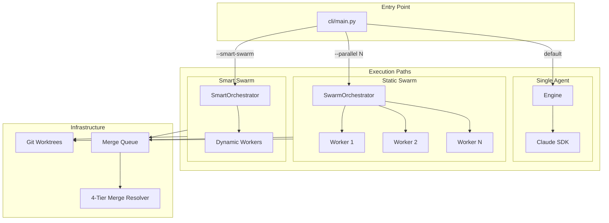

# Architecture

This document describes SwarmWeaver's package structure, execution flow, and security model. For a high-level overview, see [overview.md](overview.md).

## Package Map

```
swarmweaver/
├── cli/                         # CLI package (entry point: swarmweaver)
│   ├── main.py                    # Typer app with all subcommands
│   ├── commands/                  # One module per command
│   ├── client.py                  # HTTP client for connected mode
│   ├── config.py                  # ~/.swarmweaver/config.toml loader
│   ├── output.py                  # Rich/JSON output formatters
│   └── wizard.py                  # Interactive wizard flow
│
├── api/                         # FastAPI package (60+ endpoints + WebSocket)
│   ├── app.py                     # FastAPI app factory
│   ├── routers/                   # One router per domain
│   ├── websocket/                 # WebSocket stream handlers
│   ├── helpers.py                 # Shared request/response helpers
│   ├── models.py                  # Pydantic request/response models
│   └── state.py                   # App-level state (run registry, etc.)
│
├── core/                        # Agent loop, orchestrators, merge, worktree
│   ├── agent.py                   # Multi-phase session loop with memory harvesting
│   ├── engine.py                  # Single-agent execution (SDK streaming)
│   ├── orchestrator.py            # SwarmOrchestrator (static N workers)
│   ├── smart_orchestrator.py      # SmartOrchestrator (AI-orchestrated dynamic workers)
│   ├── merge_resolver.py          # 4-tier merge conflict resolution
│   ├── merge_queue.py             # SQLite FIFO merge queue
│   ├── swarm.py                   # Swarm + SmartSwarm entry points
│   ├── worktree.py                # Git worktree utilities
│   ├── client.py                  # Claude SDK client (security, MCP, hooks)
│   ├── prompts.py                 # Dynamic prompt builder
│   ├── agent_roles.py            # Two-layer agent role system
│   └── paths.py                   # Centralized artifact paths (.swarmweaver/)
│
├── hooks/                       # Policy enforcement hooks
│   ├── security.py                # Bash command allowlist (~60+ commands)
│   ├── capability_hooks.py        # Role-based capability enforcement
│   ├── main_hooks.py              # Server/env/file mgmt, steering, audit
│   └── marathon_hooks.py         # Auto-commit, health, loop detection
│
├── state/                       # Persistence layer
│   ├── task_list.py               # Universal task list with dependencies
│   ├── session_state.py           # Session ID tracking and resumption
│   ├── checkpoints.py             # File state checkpoints for rollback
│   ├── budget.py                  # Cost tracking and circuit breakers
│   ├── mail.py                    # Inter-agent MailStore (SQLite)
│   └── events.py                  # EventStore (SQLite)
│
├── features/                    # Mode capabilities
│   ├── steering.py                 # Mid-session steering (instruction/reflect/abort)
│   ├── approval.py                 # Approval gates
│   ├── verification.py            # Self-healing test verification loop
│   ├── memory.py                  # Cross-project learning
│   └── plugins.py                 # Custom hook plugins
│
├── services/                    # Shared helpers
│   ├── events.py                  # Structured event parser
│   ├── insights.py                # Session analytics
│   ├── timeline.py                # Cross-agent event timeline
│   ├── transcript_costs.py        # Transcript-based cost analysis
│   └── monitor.py                 # Fleet health monitor
│
├── utils/                       # Utilities
│   ├── progress.py                # Progress dashboard
│   └── sanitizer.py               # Secret redaction
│
├── prompts/                     # Prompt templates
│   ├── shared/                    # Shared across all modes
│   ├── greenfield/ feature/ refactor/ fix/ evolve/ security/
│   └── agents/                    # Role definitions (scout, builder, reviewer, lead, orchestrator)
│
├── templates/                   # Project starter specs
├── tests/                       # Python test suite
├── frontend/                    # Next.js 15 web dashboard
│
├── server.py                    # Backward-compatible shim → api/
├── autonomous_agent_demo.py     # Backward-compatible shim → cli/
└── web_search_server.py         # Standalone MCP web search server
```

## Execution Flow

SwarmWeaver supports three execution paths:

| Path | Trigger | Components |
|------|---------|------------|
| **Single Agent** | Default (no `--parallel` or `--smart-swarm`) | `Engine` → Claude SDK |
| **Static Swarm** | `--parallel N` | `SwarmOrchestrator` → N workers in git worktrees |
| **Smart Swarm** | `--smart-swarm` | `SmartOrchestrator` → AI-orchestrated dynamic workers |



For swarm modes, workers run in isolated git worktrees. When workers complete, their branches are merged via the merge queue. Conflicts are resolved through a 4-tier process: clean merge → auto-resolve → AI semantic merge → reimagine.

## Security Model

Three layers configured in `core/client.py`:

1. **OS Sandbox** — Bash commands run in an isolated environment
2. **Filesystem Permissions** — File operations restricted to the project directory via `./**` patterns
3. **Bash Allowlist** — Only approved commands run (`hooks/security.py`); ~60+ commands across file inspection, text processing, Python, Node, git, process management, shell, archive, HTTP

Additionally:

- **Role-based capability enforcement** (`hooks/capability_hooks.py`) — Scout/Reviewer = read-only; Builder = scoped writes; Lead = coordination only
- **Secret sanitizer** (`utils/sanitizer.py`) — Redacts API keys, tokens, and passwords from all output

## Related

- [overview.md](overview.md) — High-level concepts and modes
- [getting-started.md](getting-started.md) — Installation and first run
- [configuration.md](configuration.md) — Environment and config files
