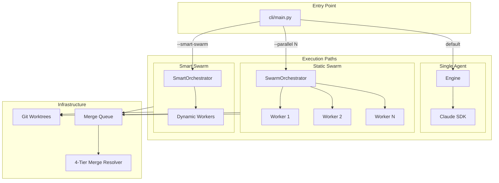

# Architecture

This document describes SwarmWeaver's package structure, execution flow, and security model. For a high-level overview, see [overview.md](overview.md).

## Package Map

```
swarmweaver/
├── cli/                         # CLI package (entry point: swarmweaver)
│   ├── main.py                    # Typer app with all subcommands
│   ├── commands/                  # One module per command
│   ├── client.py                  # HTTP client for connected mode
│   ├── config.py                  # ~/.swarmweaver/config.toml loader
│   ├── output.py                  # Rich/JSON output formatters
│   └── wizard.py                  # Interactive wizard flow
│
├── api/                         # FastAPI package (60+ endpoints + WebSocket)
│   ├── app.py                     # FastAPI app factory
│   ├── routers/                   # One router per domain
│   ├── websocket/                 # WebSocket stream handlers
│   ├── helpers.py                 # Shared request/response helpers
│   ├── models.py                  # Pydantic request/response models
│   └── state.py                   # App-level state (run registry, etc.)
│
├── core/                        # Agent loop, orchestrators, merge, worktree
│   ├── agent.py                   # Multi-phase session loop with MELS expertise harvesting
│   ├── engine.py                  # Single-agent execution (SDK streaming)
│   ├── orchestrator.py            # SwarmOrchestrator (static N workers)
│   ├── smart_orchestrator.py      # SmartOrchestrator (AI-orchestrated dynamic workers)
│   ├── merge_resolver.py          # 4-tier merge conflict resolution
│   ├── merge_queue.py             # SQLite FIFO merge queue
│   ├── swarm.py                   # Swarm + SmartSwarm entry points
│   ├── worktree.py                # Git worktree utilities
│   ├── client.py                  # Claude SDK client (security, MCP, hooks)
│   ├── prompts.py                 # Dynamic prompt builder
│   ├── agent_roles.py            # Two-layer agent role system
│   └── paths.py                   # Centralized artifact paths (.swarmweaver/)
│
├── hooks/                       # Policy enforcement hooks
│   ├── security.py                # Bash command allowlist (~60+ commands)
│   ├── capability_hooks.py        # Role-based capability enforcement
│   ├── main_hooks.py              # Server/env/file mgmt, steering, audit, mail injection
│   ├── marathon_hooks.py          # Auto-commit, health, loop detection
│   └── lsp_hooks.py               # Post-edit LSP diagnostics, cross-worker routing, watchdog signal
│
├── state/                       # Persistence layer
│   ├── task_list.py               # Universal task list with dependencies
│   ├── session_state.py           # Session ID tracking and resumption
│   ├── checkpoints.py             # File state checkpoints for rollback
│   ├── budget.py                  # Cost tracking and circuit breakers
│   ├── mail.py                    # Inter-agent MailStore (SQLite; typed payloads, attachments, analytics)
│   └── events.py                  # EventStore (SQLite)
│
├── features/                    # Mode capabilities
│   ├── steering.py                 # Mid-session steering (instruction/reflect/abort)
│   ├── approval.py                 # Approval gates
│   ├── verification.py            # Self-healing test verification loop
│   └── plugins.py                 # Custom hook plugins
│
├── services/                    # Shared helpers + MELS expertise system
│   ├── events.py                  # Structured event parser
│   ├── insights.py                # Session analytics
│   ├── expertise_models.py        # MELS data models (10 record types, domain taxonomy)
│   ├── expertise_store.py         # MELS SQLite store (CRUD, search, governance)
│   ├── expertise_scoring.py       # MELS confidence, decay, priming score
│   ├── expertise_priming.py       # MELS token-budget-aware priming engine
│   ├── expertise_synthesis.py     # MELS real-time lesson synthesis from worker errors
│   ├── timeline.py                # Cross-agent event timeline
│   ├── transcript_costs.py        # Transcript-based cost analysis
│   ├── monitor.py                 # Fleet health monitor
│   ├── lsp_client.py              # JSON-RPC 2.0 LSP client (14 operations)
│   ├── lsp_manager.py             # 22 built-in language servers, lifecycle, config
│   ├── lsp_intelligence.py        # Impact analysis, unused code, dependency graph, health score
│   └── lsp_tools.py               # Worker-facing MCP tools (lsp_query, lsp_diagnostics_summary)
│
├── utils/                       # Utilities
│   ├── progress.py                # Progress dashboard
│   └── sanitizer.py               # Secret redaction
│
├── prompts/                     # Prompt templates
│   ├── shared/                    # Shared across all modes
│   ├── greenfield/ feature/ refactor/ fix/ evolve/ security/
│   └── agents/                    # Role definitions (scout, builder, reviewer, lead, orchestrator)
│
├── templates/                   # Project starter specs
├── tests/                       # Python test suite
├── frontend/                    # Next.js 15 web dashboard
│
├── server.py                    # Backward-compatible shim → api/
├── autonomous_agent_demo.py     # Backward-compatible shim → cli/
└── web_search_server.py         # Standalone MCP web search server
```

## Execution Flow

SwarmWeaver supports three execution paths:

| Path | Trigger | Components |
|------|---------|------------|
| **Single Agent** | Default (no `--parallel` or `--smart-swarm`) | `Engine` → Claude SDK |
| **Static Swarm** | `--parallel N` | `SwarmOrchestrator` → N workers in git worktrees |
| **Smart Swarm** | `--smart-swarm` | `SmartOrchestrator` → AI-orchestrated dynamic workers |



For swarm modes, workers run in isolated git worktrees. When workers complete, their branches are merged via the merge queue. Conflicts are resolved through a 4-tier process: clean merge → auto-resolve → AI semantic merge → reimagine.

### Inter-Agent Mail System

Swarm workers and orchestrators coordinate through an SQLite-backed mail system (`state/mail.py`):

- **15 message types** (dispatch, worker_done, worker_progress, error, escalation, merged, etc.) with 4 priority levels
- **Typed protocol payloads** with schema validation per message type
- **Context injection** — unread mail is formatted and injected into agent prompts via `mail_injection_hook` (PostToolUse)
- **Reply auto-routing** and threaded conversations with summarization for long threads
- **Priority escalation** — urgent (5 min) and high (15 min) messages get automatic reminders
- **Dead letter queue** with rate limiting (20 msgs/min for low/normal priority)
- **WebSocket push** — `on_send` callback fires `mail_received` events for real-time UI updates
- **Message attachments** (file_diff, code_snippet, task_list, error_trace) with 5KB size limit
- **Analytics** — top senders, unread bottlenecks, avg response time, dead letter count
- **CLI**: `swarmweaver mail list|send|read|thread|stats|purge`
- **API**: `GET /api/swarm/mail/analytics`

## Watchdog System

The enhanced watchdog provides production-grade health monitoring for swarm workers:

### 3-Tier Architecture

| Tier | Component | Purpose |
|------|-----------|---------|
| **Tier 0: Mechanical Daemon** | `SwarmWatchdog` loop in `services/watchdog.py` | Periodic health checks every 30s, state transitions, nudges |
| **Tier 1: AI Triage** | `_ai_triage_llm()` | Ephemeral Claude session analyzes stalled workers with 7 data sources |
| **Tier 2: Monitor Agent** | `analyze_stalled_worker` MCP tool | Orchestrator can request on-demand triage for any worker |

### 9-State Forward-Only State Machine

```
BOOTING → WORKING → IDLE → WARNING → STALLED → RECOVERING → COMPLETED
                                                    ↓
                                                TERMINATED
Any state → ZOMBIE (PID dead) → TERMINATED
```

States: `BOOTING`, `WORKING`, `IDLE`, `WARNING`, `STALLED`, `RECOVERING`, `COMPLETED`, `ZOMBIE`, `TERMINATED`. Transitions are validated against an explicit `ALLOWED_TRANSITIONS` table — invalid transitions are rejected.

### 7-Signal Health Evaluation (Priority Order)

1. **asyncio.Task state** — done/cancelled/exception (highest priority)
2. **PID liveness** — `os.kill(pid, 0)`
3. **Output freshness** — time since last stdout
4. **Tool call activity** — catches "thinking" phases that look like stalls
5. **Git commit activity** — `git log --since` on worker branch
6. **Heartbeat** — active heartbeat protocol via mail system
7. **LSP diagnostic trend** — rising error count signals worker may be struggling

### Circuit Breaker

Prevents cascading failures from draining budget:
- **CLOSED** — normal operation, spawning allowed
- **OPEN** — >50% failure rate, spawning blocked
- **HALF_OPEN** — tentatively allow one test spawn after cooldown

### Data Flow

```
Workers → Heartbeat/Output → Watchdog Daemon → State Machine
                                    ↓
                            AI Triage (if stalled)
                                    ↓
                    WebSocket Events → Frontend Health Tab
```

### Persistent Event Log

All state transitions, nudges, triage results, and terminations are recorded in `watchdog_events.db` (SQLite). Query via API (`GET /api/watchdog/events`) or CLI (`swarmweaver watchdog events`).

### Configuration

`watchdog.yaml` in `.swarmweaver/` with env var overrides (`WATCHDOG_*`). See [configuration.md](configuration.md) for full reference.

## LSP Code Intelligence

Native Language Server Protocol integration provides real-time code analysis for swarm workers.

### Architecture

| Component | File | Purpose |
|-----------|------|---------|
| LSP Client | `services/lsp_client.py` | JSON-RPC 2.0 over stdio, 14 LSP operations |
| LSP Manager | `services/lsp_manager.py` | 22 built-in server specs, lifecycle, auto-detect/install |
| LSP Hooks | `hooks/lsp_hooks.py` | Post-edit diagnostic injection, cross-worker routing |
| LSP Tools | `services/lsp_tools.py` | Worker MCP tools (`lsp_query`, `lsp_diagnostics_summary`) |
| Code Intelligence | `services/lsp_intelligence.py` | Impact analysis, unused code, dependency graph, health score |
| API | `api/routers/lsp.py` | 13 REST endpoints |
| CLI | `cli/commands/lsp.py` | 5 CLI commands |
| Frontend | `frontend/app/components/LSPPanel.tsx` | Code Intel dashboard |

### 22 Built-in Language Servers (4 Tiers)

| Tier | Servers |
|------|---------|
| **Core** | typescript-language-server, pyright, gopls, rust-analyzer |
| **Secondary** | clangd, jdtls, solargraph, intelephense, kotlin-language-server, sourcekit-lsp |
| **Specialty** | zls, lua-language-server, elixir-ls, gleam, deno |
| **Config/Markup** | yaml-language-server, bash-language-server, dockerfile-language-server, terraform-ls, css/html/vue language servers |

Servers are auto-detected from project markers (e.g., `tsconfig.json` → TypeScript, `pyproject.toml` → Python) and lazily spawned per worktree.

### Data Flow

```
Worker edits file → lsp_post_edit_hook (PostToolUse)
    → LSP didChange → wait for diagnostics (≤3s, 150ms debounce)
    → Errors injected into agent context
    → Cross-worker diagnostics routed via mail system
    → Watchdog receives diagnostic trend as 7th health signal
```

### Per-Worktree Isolation

Each swarm worker gets its own LSP server instances, tagged with `worker_id`. Diagnostics from one worker's edits that affect another worker's file scope are automatically routed via the inter-agent mail system.

### Post-Merge Validation

After merging a worker's branch, the orchestrator runs LSP diagnostics on all changed files. New errors are reported as `lsp.merge_validation` events.

## Security Model

Three layers configured in `core/client.py`:

1. **OS Sandbox** — Bash commands run in an isolated environment
2. **Filesystem Permissions** — File operations restricted to the project directory via `./**` patterns
3. **Bash Allowlist** — Only approved commands run (`hooks/security.py`); ~60+ commands across file inspection, text processing, Python, Node, git, process management, shell, archive, HTTP

Additionally:

- **Role-based capability enforcement** (`hooks/capability_hooks.py`) — Scout/Reviewer = read-only; Builder = scoped writes; Lead = coordination only
- **Secret sanitizer** (`utils/sanitizer.py`) — Redacts API keys, tokens, and passwords from all output

## Related

- [overview.md](overview.md) — High-level concepts and modes
- [getting-started.md](getting-started.md) — Installation and first run
- [configuration.md](configuration.md) — Environment and config files
