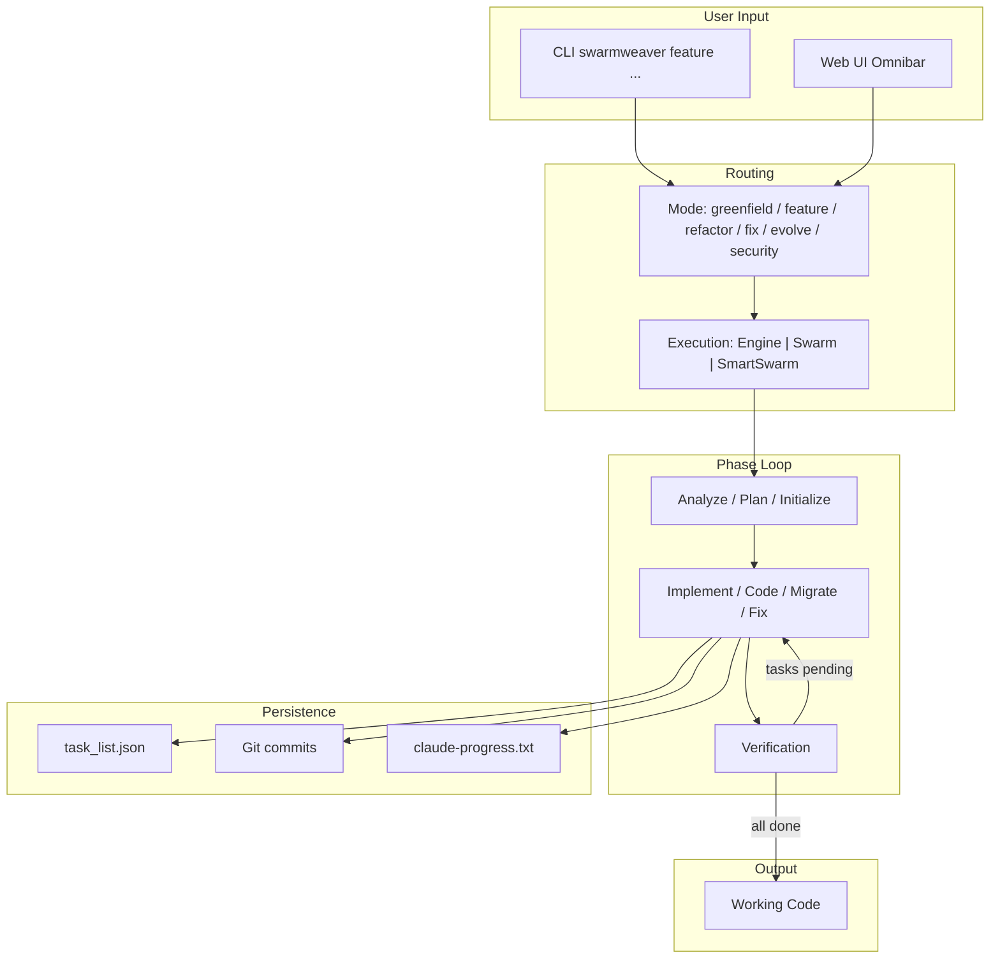

# SwarmWeaver Overview

SwarmWeaver is a Python harness that runs Claude as a long-running autonomous coding agent. Unlike one-shot code generation, SwarmWeaver works across **many sessions** with fresh context windows, persisting progress through a task list, git commits, and handoff notes. It can run for hours or days unattended.

## Six Operation Modes

Each mode covers a different phase of the codebase lifecycle:

| Mode | What It Does | Example |
|------|-------------|---------|
| `greenfield` | Builds a new project from a specification file | "Build me a SaaS dashboard from this spec" |
| `feature` | Adds features to an existing codebase | "Add OAuth2 login with Google and GitHub" |
| `refactor` | Restructures or migrates a codebase | "Migrate from JavaScript to TypeScript" |
| `fix` | Diagnoses and fixes bugs | "Login fails when email has a plus sign" |
| `evolve` | Improves a codebase toward a goal | "Add unit tests for 80% coverage" |
| `security` | Scans for vulnerabilities with human review | "Full security audit of the API layer" |

## Phase-Based Execution

Each mode follows a phase-based execution pattern:

```
greenfield:  initialize ──> code* ──> code* ──> ... ──> done
feature:     analyze ──> plan ──> implement* ──> implement* ──> ... ──> done
refactor:    analyze ──> plan ──> migrate* ──> migrate* ──> ... ──> done
fix:         investigate ──> fix* ──> fix* ──> ... ──> done
evolve:      audit ──> improve* ──> improve* ──> ... ──> done
security:    scan ──> [human review] ──> remediate* ──> ... ──> done

* = looping phase (repeats until all tasks are complete)
```

## Cross-Cutting Capabilities

All modes share these capabilities:

- **Approval gates** — Pause the agent for human review at key checkpoints
- **Worktree isolation** — Run in isolated git worktrees; merge or discard on completion
- **Verification loop** — Self-healing test verification
- **Cross-project memory** — Learn from past sessions and inject relevant patterns
- **4-tier merge resolution** — Clean → auto → AI → reimagine for swarm conflicts
- **Security allowlist** — Bash commands validated against an allowlist (~60+ commands)

## End-to-End Workflow



## Execution Paths

- **Single agent** — Default; one Claude session with phase loop
- **Static swarm** (`--parallel N`) — N workers in isolated worktrees, coordinated by SwarmOrchestrator
- **Smart swarm** (`--smart-swarm`) — AI-orchestrated dynamic workers via SmartOrchestrator

## Related Documentation

- [Getting Started](getting-started.md) — Installation and first run
- [Architecture](architecture.md) — Package map, execution flow, security
- [CLI Reference](cli-reference.md) — Commands and flags
- [Web UI](web-ui.md) — Dashboard capabilities
- [Configuration](configuration.md) — Environment and config files

[← Back to docs index](README.md) | [Main README](../README.md)
